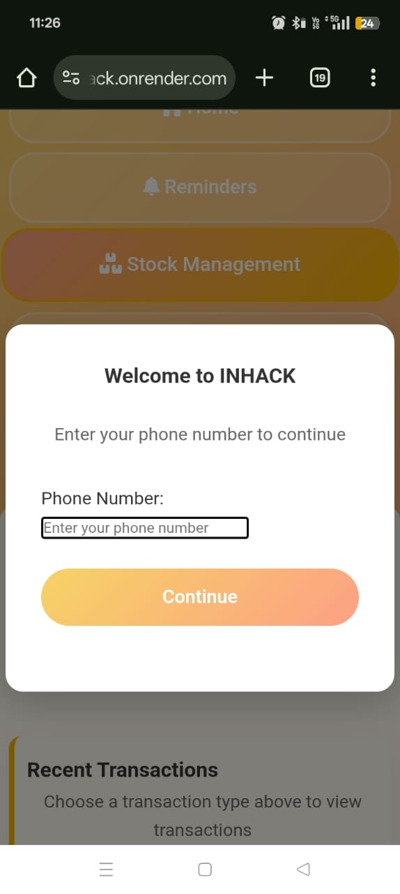
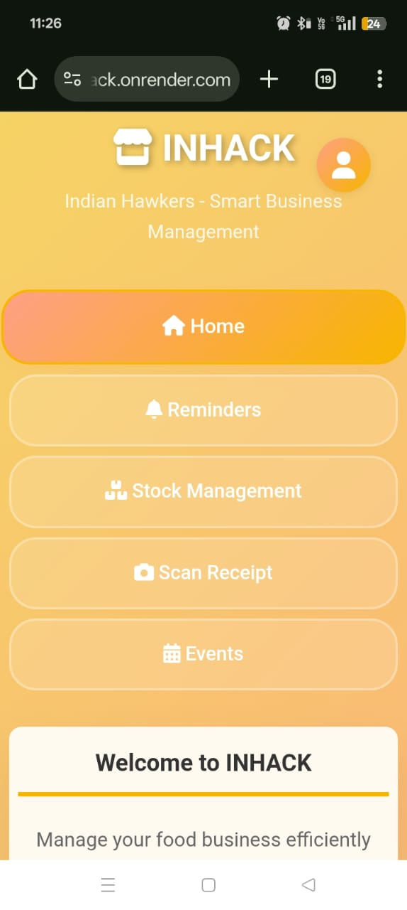
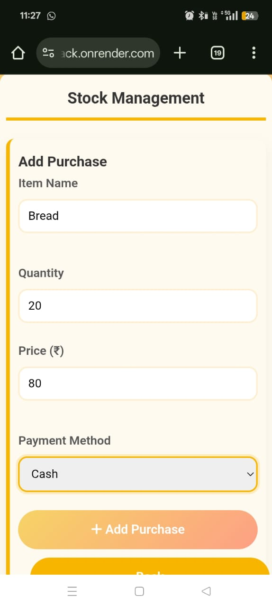
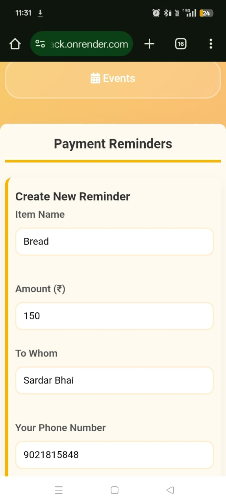
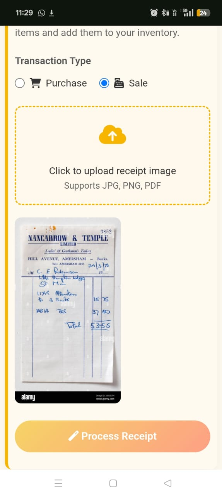
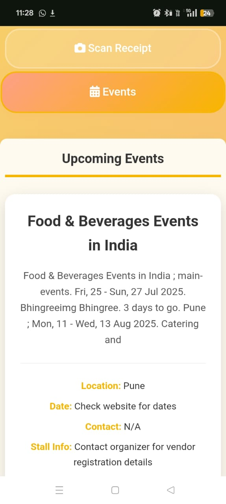

# INHACK - Indian Hawkers

INHACK is a comprehensive business management application designed specifically for Indian street food vendors and small business owners. The platform provides essential tools to manage inventory, track payments, set reminders, and more - all in one place.

## Table of Contents

- [Features](#features)
- [Tech Stack](#tech-stack)
- [Installation](#installation)
- [Configuration](#configuration)
- [Running the Application](#running-the-application)
- [Frontend Components](#frontend-components)
- [Pictures](#pictures)

## Features

### 1. Vendor Management
- Vendor registration and authentication
- Profile management
- Session-based login system

### 2. Stock Management
- Track purchases and sales
- Real-time inventory updates
- Receipt scanning with AI-powered item extraction
- Responsive tables for mobile and desktop

### 3. Payment Reminders
- Schedule payment reminders for suppliers
- WhatsApp integration for automatic notifications
- Vendor-specific reminder visibility
- Celery-based background task scheduling

### 4. Event Discovery
- Find local business events and opportunities
- Event details and registration information
- Location-based event recommendations

### 5. Smart Receipt Scanning
- Upload receipt images for automatic processing
- AI-powered text extraction using LLM Model from groq
- Automatic item and price detection
- Add scanned items directly to inventory

## Tech Stack

### Backend
- **FastAPI**: Modern, fast (high-performance) web framework for building APIs
- **SQLAlchemy**: SQL toolkit and Object-Relational Mapping (ORM) library
- **SQLite**: Lightweight database for development
- **Celery**: Distributed task queue for background processing
- **Redis**: Message broker for Celery
- **Twilio**: WhatsApp API integration for reminders

### Frontend
- **HTML5/CSS3/JavaScript**: Vanilla JavaScript implementation
- **Font Awesome**: Icon library
- **Responsive Design**: Mobile-first approach

### AI/ML Services
- **Vision Model**: OCR for receipt scanning
- **Groq**: AI-powered text processing

### Development Tools
- **Uvicorn**: ASGI server for development
- **Pydantic**: Data validation and settings management
- **Python-dotenv**: Environment variable management


## Installation

1. Clone the repository:
   ```bash
   git clone <repository-url>
   cd InHack/backend
   ```

2. Create a virtual environment:
   ```bash
   python -m venv venv
   source venv/bin/activate  # On Windows: venv\Scripts\activate
   ```

3. Install dependencies:
   ```bash
   pip install -r requirements.txt
   ```

4. Install additional dependencies (if needed):
   ```bash
   pip install pydantic-settings
   ```

## Configuration

Create a `.env` file in the `backend/` directory with the following variables:

```env
# Database
DATABASE_URL=sqlite:///./INHACK.db

# API Keys
TWILIO_SID=your_twilio_sid
TWILIO_AUTH_TOKEN=your_twilio_auth_token
GROQ_API_KEY=your_groq_api_key
GOOGLE_APPLICATION_CREDENTIALS=path_to_your_google_credentials.json

# Celery
CELERY_BROKER_URL=redis://localhost:6379/0
CELERY_RESULT_BACKEND=redis://localhost:6379/0

# Application Settings
DEBUG=True
ALLOWED_ORIGINS=http://localhost:3000,http://localhost:8000
TIMEZONE=Asia/Kolkata
```

## Running the Application

1. Start the Redis server (required for Celery):
   ```bash
   redis-server
   ```

2. Start the Celery worker (in a separate terminal):
   ```bash
   cd backend
   celery -A core worker --loglevel=info
   ```

3. Start the FastAPI application:
   ```bash
   cd backend
   python main.py
   ```

4. Access the application at `http://localhost:8000`

## Frontend Components

The frontend is a single-page application built with vanilla JavaScript, featuring:

1. **Responsive Navigation**: Mobile-friendly tab-based navigation
2. **Vendor Authentication**: Login/registration modal system
3. **Stock Management Interface**:
   - Purchase and sale forms
   - Transaction listing with filtering
   - Edit modal for updating transactions
4. **Payment Reminders**:
   - Reminder creation form
   - Reminder listing with status indicators
   - Delete functionality
5. **Receipt Scanner**:
   - Image upload interface
   - AI-powered item extraction
   - Manual item editing before saving
6. **Event Discovery**:
   - Search interface
   - Event cards with details
7. **Profile Management**:
   - Dropdown with username display
   - Profile editing modal

**pictures**:

---

## 📸 Screenshots

### 🔐 Login Page



---

### 🏠 Home Page



---

### 📦 Stock Management



---

### 💰 Payment Reminders

**Dashboard View:**


**WhatsApp Reminder Interface:**


---

### 🧾 Scan Receipt



---

### 🎉 Event Finder



